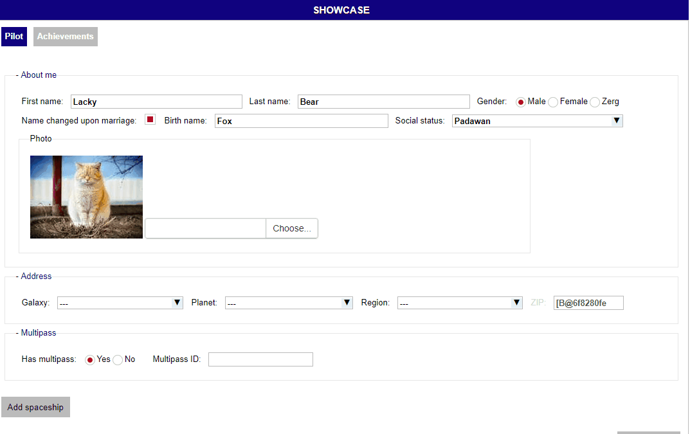
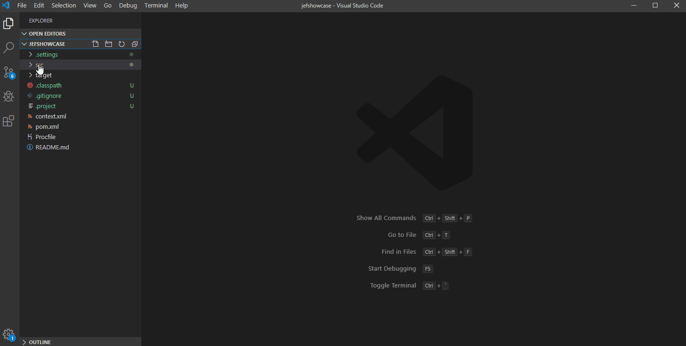
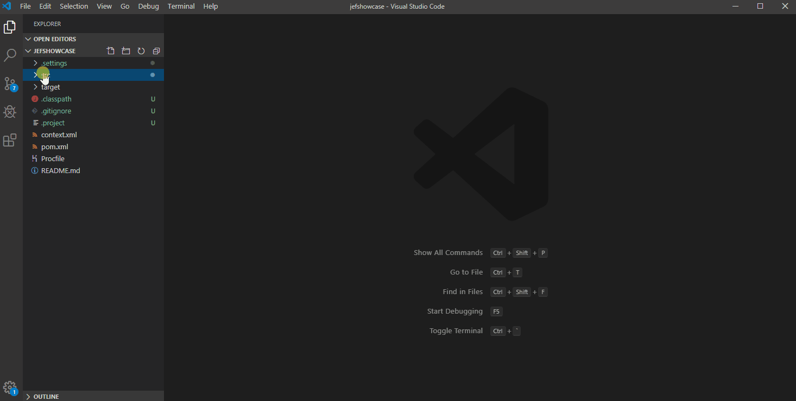
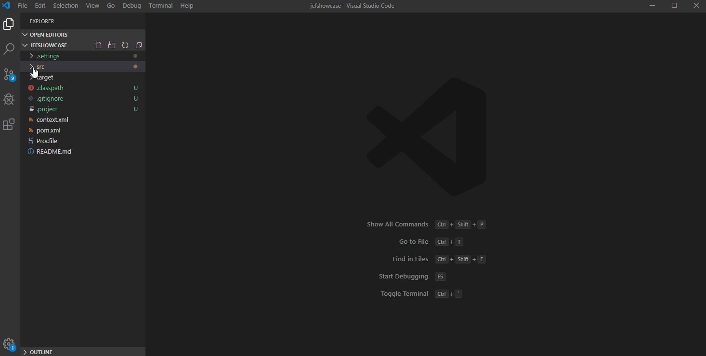

# Java Enterprise Form framework

It's simple RESTy framework for fast developing forms with dependent on each other fields, like this:


*Show case project https://github.com/murmilad/jefshowcase*

## Howo to develop
Simple bunch of steps:

### Form design with XML 
Declare interface with fields and theirs connections 


### Create your Form and implement fields
Just cteate your Form inherited Class and implement Listeners for your fields


###  Implement Load/Save methods
Create load and save methods for sour Form


### Register your new form


## Technical details
### REST Entry point
Implement Java services *aka Jersey, Django,.. etc.* using this Framework classess. 

There a example on Jersey framework *You can just copy them if you would use Jersey*:

```

@Path("/form") // path that you set up in your form XML (interface/service)
@Produces(MediaType.APPLICATION_JSON + ";charset=utf-8")
public class FormWebService{
	
	@Context
	HttpServletRequest request;
	
	@Context
	HttpServletResponse response;
	@Context
	HttpServletRequest request;
	
	@Context
	HttpServletResponse response;
	
	/**
	* Your own service inherited by Framework Service class (see ex. https://github.com/murmilad/jefshowcase)
	*/
	private Service<JefShowcaseFormFactory> service = new Service<JefShowcaseFormFactory>(new JefShowcaseFormFactory());

	/**
	 * Getting formitems data on loading 
	 * 
	 * @param formApi API, that you setted up in your form XML (interface/forms/form/form_item/api)
	 * @param parameters Separated parameters
	 * 
	 * @return Goups of parameters of your forms
	 * @throws ServiceException
	 */

	@POST
	@Path("/get")
	public FormDto getInterfaceData(
			@FormParam(FORM_API) String formApi,
			@FormParam(PARAMETERS) String parameters
			) throws ServiceException {


		Map<String,String> parametersMap = listToMap(parameters);

		Integer id = parametersMap.get("uri_id") != null ? Integer.valueOf(parametersMap.get("uri_id")) : null; 

		FormDto interfaceData = null;
		try {
			interfaceData =  service.getFormDto(id, formApi, parametersMap);
		} catch ( ServiceException e) {
			if (e.getCause() instanceof IllegalArgumentException) {
				interfaceData = new FormDto(new ErrorDto(INCORRECT_PARAMETER_ERROR_CODE, e.getMessage()));
			} else {
				throw new ServiceException(e.getMessage(),e);
			}
		}

		
		return interfaceData;
		
	}

	/**
	 * Getting list of items for 'list' fields 
	 * 
	 * @param formApi API, that you setted up in your form XML (interface/forms/form/form_item/api)
	 * @param parameterName Name of the current parameter
	 * @param parameters Separated parameters
	 * 
	 * @return list of items for field
	 * @throws ServiceException
	 */

	@POST
	@Path("/get_list")
	public ListDto<ListItemDto> getListData(
			@FormParam(FORM_API) String formApi,
			@FormParam(PARAMETER_NAME) String parameterName,
			@FormParam(PARAMETERS) String parameters
			) throws ServiceException {

		HttpSession session = request.getSession();

		Map<String,String> parametersMap = listToMap(parameters);

		Integer id = parametersMap.get("uri_id") != null ? Integer.valueOf(parametersMap.get("uri_id")) : null; 

		ListDto<ListItemDto> listData = null;
		try {
			return new ListDto<ListItemDto>(SERVICE_STATUS_OK, service.getListData(id, formApi, parameterName, parametersMap));
			
		} catch ( ServiceException e) {
			if (e.getCause() instanceof IllegalArgumentException) {
				listData = new ListDto<ListItemDto>(new ErrorDto(INCORRECT_PARAMETER_ERROR_CODE, e.getMessage()));
			} else {
				throw new ServiceException(e.getMessage(),e);
			}
		}

		
		return listData;
		
	}

	/**
	 * Save form
	 * 
	 * @param parameters Separated parameters
	 * 
	 * @return Result with status and errors if exists 
	 * @throws ServiceException
	 */

	@POST
	@Path("/set")
	public ResultDto setFormData(
			@FormParam(PARAMETERS)String parameters
			) throws ServiceException {

		CurrentLocale.getInstance().setLocale(new Locale("en_US"));

		HttpSession session = request.getSession();

		Map<String,String> parametersMap = listToMap(parameters);

		Integer id = parametersMap.get("uri_id") != null ? Integer.valueOf(parametersMap.get("uri_id")) : null; 

		ResultDto result = null;
		try {

			result = service.setFormData(id, parametersMap);
		} catch ( ServiceException e) {
			if (e.getCause() instanceof IllegalArgumentException) {
				result = new ResultDto(new ErrorDto(INCORRECT_PARAMETER_ERROR_CODE, e.getMessage()));
			} else {
				throw new ServiceException(e.getMessage(),e);
			}
		}

		
		return result;
		
	}	


	/**
	 * Get list of items for 'list' field that depends on some other fields
	 * 
	 * @param formApi API, that you setted up in your form XML (interface/forms/form/form_item/api)
	 * @param parameterName Name of the current parameter
	 * @param parameters Separated parameters
	 * 
	 * @return list of items for field
	 * @throws ServiceException
	 */

	@POST
	@Path("/get_list_interactive")
	public ListDto<ListItemDto> getListInteractiveData(
			@FormParam(FORM_API) String formApi,
			@FormParam(PARAMETER_NAME) String parameterName,
			@FormParam(PARAMETERS)String parameters
			) throws ServiceException {

		HttpSession session = request.getSession();

		Map<String,String> parametersMap = listToMap(parameters);

		Integer id = parametersMap.get("uri_id") != null ? Integer.valueOf(parametersMap.get("uri_id")) : null; 


		ListDto<ListItemDto> listData = null;
		try {
			return new ListDto<ListItemDto>(SERVICE_STATUS_OK, service.getInteractiveListData(id, formApi, parameterName, listToMap(parameters)));
			
		} catch ( ServiceException e) {
			if (e.getCause() instanceof IllegalArgumentException) {
				listData = new ListDto<ListItemDto>(new ErrorDto(INCORRECT_PARAMETER_ERROR_CODE, e.getMessage()));
			} else {
				throw new ServiceException(e.getMessage(),e);
			}
		}

		
		return listData;
		
	}	

	
	/**
	 * Get value for field that depends on some other fields
	 * 
	 * @param formApi API, that you setted up in your form XML (interface/forms/form/form_item/api)
	 * @param parameterName Name of the current parameter
	 * @param parameters Separated parameters
	 * 
	 * @return value of field
	 * @throws ServiceException
	 */

	@POST
	@Path("/get_value_interactive")
	public ValueDto<String> getValue(
			@FormParam(FORM_API) String formApi,
			@FormParam(PARAMETER_NAME) String parameterName,
			@FormParam(PARAMETERS) String parameters
			) throws ServiceException {

		try {
		    parameters = java.net.URLDecoder.decode(parameters, StandardCharsets.UTF_8.name());
		} catch (UnsupportedEncodingException e) {
		    // not going to happen - value came from JDK's own StandardCharsets
		}
		
		HttpSession session = request.getSession();

		Map<String,String> parametersMap = listToMap(parameters);

		Integer id = parametersMap.get("uri_id") != null ? Integer.valueOf(parametersMap.get("uri_id")) : null; 

		ValueDto<String> valueData = null;
		try {
			return new ValueDto<String>(SERVICE_STATUS_OK, service.getValueData(id, formApi, parameterName, listToMap(parameters)));
			
		} catch ( ServiceException e) {
			if (e.getCause() instanceof IllegalArgumentException) {
				valueData = new ValueDto<String>(new ErrorDto(INCORRECT_PARAMETER_ERROR_CODE, e.getMessage()));
			} else {
				throw new ServiceException(e.getMessage(),e);
			}
		}

		
		return valueData;
		
	}	


	/**
	 * Get sign of visiblity for field that depends on some other fields
	 * 
	 * @param formApi API, that you setted up in your form XML (interface/forms/form/form_item/api)
	 * @param parameterName Name of the current parameter
	 * @param parameters Separated parameters
	 * 
	 * @return boolean value
	 * @throws ServiceException
	 */

	@POST
	@Path("/get_is_visible_interactive")
	public ValueDto<Boolean> getIsVisible(
			@FormParam(FORM_API) String formApi,
			@FormParam(PARAMETER_NAME) String parameterName,
			@FormParam(PARAMETERS) String parameters
			) throws ServiceException {

		HttpSession session = request.getSession();

		Map<String,String> parametersMap = listToMap(parameters);

		Integer id = parametersMap.get("uri_id") != null ? Integer.valueOf(parametersMap.get("uri_id")) : null; 

		ValueDto<Boolean> valueData = null;
		try {
			return new ValueDto<Boolean>(SERVICE_STATUS_OK, service.getIsVisible(id, formApi, parameterName, listToMap(parameters)));
			
		} catch ( ServiceException e) {
			if (e.getCause() instanceof IllegalArgumentException) {
				valueData = new ValueDto<Boolean>(new ErrorDto(INCORRECT_PARAMETER_ERROR_CODE, e.getMessage()));
			} else {
				throw new ServiceException(e.getMessage(),e);
			}
		}

		
		return valueData;
		
	}

	/**
	 * Get if fiels active sign that depends on some other fields
	 * 
	 * @param formApi API, that you setted up in your form XML (interface/forms/form/form_item/api)
	 * @param parameterName Name of the current parameter
	 * @param parameters Separated parameters
	 * 
	 * @return boolean value
	 * @throws ServiceException
	 */

	@POST
	@Path("/get_is_active_interactive")
	public ValueDto<Boolean> getIsActive(
			@FormParam(FORM_API) String formApi,
			@FormParam(PARAMETER_NAME) String parameterName,
			@FormParam(PARAMETERS) String parameters
			) throws ServiceException {

		HttpSession session = request.getSession();

		Map<String,String> parametersMap = listToMap(parameters);

		Integer id = parametersMap.get("uri_id") != null ? Integer.valueOf(parametersMap.get("uri_id")) : null; 

		ValueDto<Boolean> valueData = null;
		try {
			return new ValueDto<Boolean>(SERVICE_STATUS_OK, service.getIsActive(id, formApi, parameterName, listToMap(parameters)));
			
		} catch ( ServiceException e) {
			if (e.getCause() instanceof IllegalArgumentException) {
				valueData = new ValueDto<Boolean>(new ErrorDto(INCORRECT_PARAMETER_ERROR_CODE, e.getMessage()));
			} else {
				throw new ServiceException(e.getMessage(),e);
			}
		}

		
		return valueData;
		
	}


	private Map<String,String> listToMap(String list) {
		Map<String,String> parametersMap = new HashMap<String,String>();
		
		for (String parameter: list.split(PARAMETER_SEPARATOR)) {
			Pattern pattern = Pattern.compile("(.*)"+PARAMETER_NAME_VALUE_SEPARATOR+"(.*)");
			Matcher matcher = pattern.matcher(parameter);
			if (matcher.matches()) {
				parametersMap.put(matcher.group(1), matcher.group(2));
			}
		}
		return parametersMap;
		
	}

	
	
	/**
	 * BASE 64 entry point for images in the IE<10 
	 * 
	 * @param inputStream Image stream
	 *
	 * @return String of base64URI
	 * @throws ServiceException
	 */
	
	@POST
    @Path("/image_to_base64")
    public Response imageToBase64(
            @FormDataParam("file") InputStream fileInputStream
    ) throws ServiceException {
 

   	    return Response.ok(service.imageToBase64(fileInputStream), "text/html")
   	    		.build();
        

    }	

```
If you use  not-Jersey  you can create your own service with that entrypoints.


 

