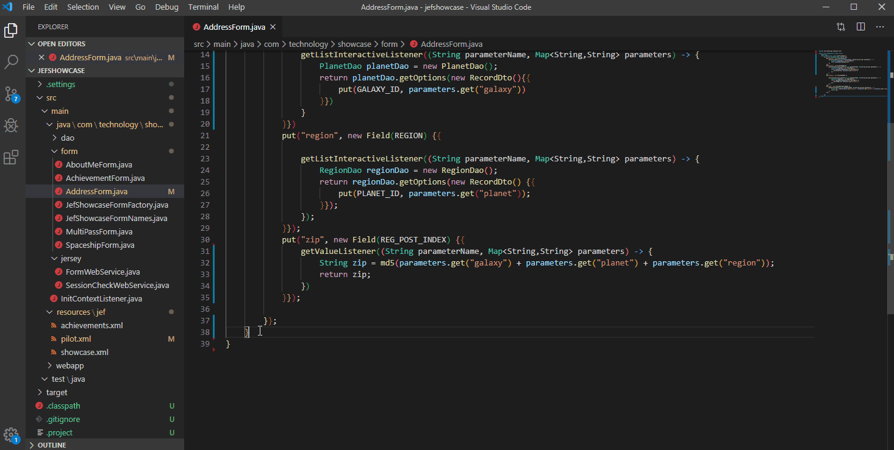

# Java Enterprise Form framework

It's simple RESTy framework for fast developing forms with dependent on each other fields, like this:


*Showcase project https://github.com/murmilad/jefshowcase*

## Howo to develop
Simple bunch of steps:

### Form design with XML 
Declare interface with fields and theirs connections 


### Create your Form and implement fields
Just cteate your Form inherited Class and implement Listeners for your fields


###  Implement Load/Save methods
Create load and save methods for sour Form


### Register your new form


## Technical details
### REST Entry point
Implement Java services *aka Jersey, Django,.. etc.* using this Framework classess. 
This link for Jersey realisation: 
```
https://github.com/murmilad/jefshowcase/blob/master/src/main/java/com/technology/showcase/jersey/FormWebService.java
```
If you use  non-Jersey realisation you can create your own FormWebService but using same functional as the link above .


 

